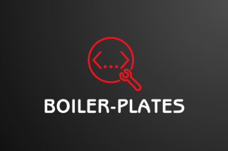

<p align="center"> </p>


# 🚀 Awesome Code and Configuration Boilerplates🛠️


### Welcome to the Awesome Code and Configuration Boilerplates repository! Your ultimate source for elegant and well-structured boilerplate code, empowering you to jumpstart projects and streamline configurations with finesse.


[](https://opensource.org/licenses/)


## Copy Projects Locally 

Clone the project 


```bash
  git clone https://github.com/Brandon-Roff/Boilerplates
```

Go to the project directory

```bash
  cd Boilerplates
```


# Boiler Plate List
<center>
<h3> Media Box </h3>
</center>

| Program | Project URL | Docker-Compose 🐳 | Systemd | Standard Port |
| :--: | :--: | :--: | :--: | :--: |
| [Bazarr 🗚](Docker/Media/Bazarr/) | https://www.bazarr.media/ | `✅` | `❌` | 6767/tcp |
| [Lidarr🎵](Docker/Media/Lidarr/) | https://lidarr.audio/ | `✅` | `❌` | 8686/tcp |
| [Prowlarr 🌐🔗](Docker/Media/Prowlarr) | https://prowlarr.com/ | `✅` | `❌` | 9696/tcp |
| [Radarr🎬](Docker/Media/Radarr/) | https://radarr.video/ | `✅` | `❌` | 7878/tcp |
| [Sonarr📺](Docker/Media/Sonarr/) | https://sonarr.tv/ | `✅` | `❌` | 8989/tcp |
| [Transmission 🧲](Docker/Media/Transmission/docker-compose.yml) | https://transmissionbt.com/ | `✅` | `❌` | 9091/tcp |
| [Podgrab 🎧](Docker/Media/PodGrab/docker-compose.yml) | https://github.com/akhilrex/podgrab | `✅` | `❌` | 8787/tcp |
|  |  |  |  |  |

## Or install them all with the MediaBox [Docker Compose Template!](Docker/Media/docker-compose.yml)


## 🛤️ <span style="color:#00ff00;">Roadmap</span> 

- Add Docker Compose Templates

- Add Apache Config Examples

- Add NGINX Configs

- Many More!


## Optimizations

Depends per projects

